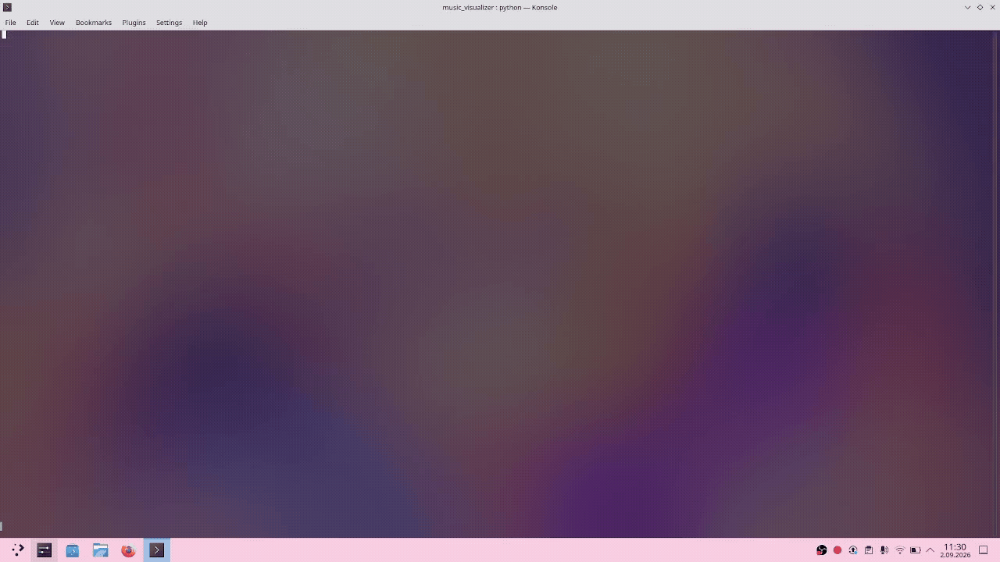
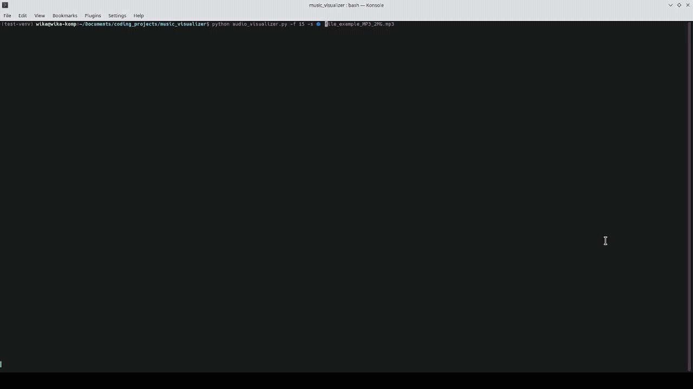

# Audio Visualizer CLI
---
## Table of contents
- [Overview](#overview)
- [Launching and usage](#launching-and-usage)
- [Code structure](#code-structure)

## Overview
Audio Visualizer CLI python program that can create a visualization of audio in the terminal. The visualization is synchronised with audio playback. 

The audio visualization uses grouped amplitude spectrum values.

It uses the curses library for display, soundfile for reading audio files, sounddevice for audio playback, numpy for FFT calculation.

The program supports and was tested using MP3 and WAV files.
## Launching and usage
The project was developed and tested using Python 3.14.4. After cloning the repository install the dependencies using pip from the right requirements file. 

### Linux
```bash
pip install -r linux-requirements.txt
```

### Windows
```bash
pip install -r windows-requirements.txt
```

There are two different requirements files - [one for windows](windows-requirements.txt) and [one for linux](linux-requirements.txt), since on windows the windows-curses module needs to be used instead of the normal curses module.

The command to run the program uses the format below:
```bash
python audio_visualizer.py [options] <filename>
```

Filename is a required argument - a relative or absolute path to the audio file to be played.
Options are optional arguments listed below:
- -f, --frame-rate - framerate of the display, by default the framerate is 30
- -s, --symbol - symbol that will be used for the visualization's display. By default the symbol used is ■
- -sc, --scale {linear,log} - set the display's scale. You can choose from logarithmic and linear scale. By default the log scale is used.




[Video example with sound.](docs/assets/default_options_example.mp4)
Audio in the example video taken from [https://royaltyfreemusiclibrary.com/](https://royaltyfreemusiclibrary.com/). The examples above use default options for the program.


The display will be as big as the terminal was at launch time. Do not resize the terminal window after launching the program. If during audio playback small breaks or stutters appear it is probably a result of output underflow in the audio callback.



[Video with audio](docs/assets/different_options_example.mp4)

## Code structure
The most important classes in the program are:
- [SampleProcessor](sample_processing.py) - class overseeing all processing of audio samples - synchronising the processing, calculating amplitude spectrum, providing samples for playback

- [AmplitudeDisplay](amplitude_display.py) - plots and draws the processed and grouped amplitude values to the terminal. 

- [ScalingStrategy](amplitude_display.py) and its children - provide methods for grouping together amplitude values into bins for log and linear scale. Regardless of what scale was used, root mean square (rms) is used for grouping values in each bin.

The program runs three different threads:
- __producer thread__ - produces blocks of samples to be played and amplitude spectrum values to be displayed. This thread pushes its result onto two queues - the amplitude queue and the audio queue. For each block of audio a block of amplitude values is produced.

- __audio playback thread__ - plays audio, consumer for the audio queue

- __amplitude display thread__ - displays the amplitude spectrum, consumer for the amplitude queue. Additionally raises errors thrown in other threads.

All of those threads use the error queue to communicate any exceptions that occurred. Those exceptions are later raised in the display thread. 

Python's Queue is thread safe, and synchronises the transfer of data between the producer and consumers.